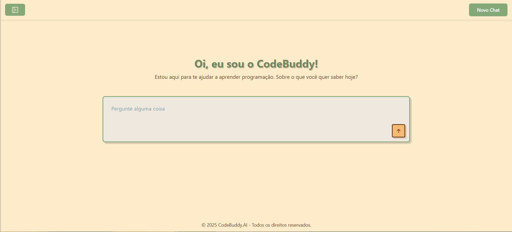
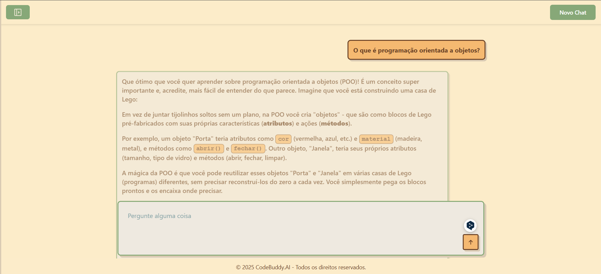

# [CodeBuddy.AI 🤖💻](https://alinerhanny.github.io/CodeBuddy.AI/)
## 📚 Apresentação
O CodeBuddy.AI é uma plataforma inteligente de apoio à aprendizagem de programação, criada para proporcionar uma experiência interativa e personalizada. Com ele, usuários de todos os níveis podem tirar dúvidas, obter explicações detalhadas e receber ajuda prática na hora de programar — tudo isso com a fluidez e agilidade de um assistente virtual alimentado por inteligência artificial.

Nossa missão é democratizar o ensino da programação, tornando-o acessível, eficiente e engajador. Seja você um iniciante buscando entender os conceitos básicos ou um desenvolvedor experiente que precisa de um suporte rápido, o CodeBuddy.AI está aqui para te ajudar.

## 🚀 Funcionalidades
- Chat interativo com IA para responder perguntas de programação em tempo real.

- Suporte a múltiplas linguagens e conceitos, com respostas formatadas e código destacado.

- Histórico de chats para revisitar conversas anteriores.

- Sidebar para navegação rápida entre chats salvos.

- Feedback visual em tempo real enquanto o sistema processa suas dúvidas.

- Capacidade de iniciar novos chats para diferentes tópicos.

## 🛠️ Tecnologias Utilizadas
- Frontend: HTML5, CSS3, JavaScript (Vanilla)

- Backend: Node.js 

- Google Gemini API – inteligência artificial para geração das respostas

- Bibliotecas:

    -  Marked.js para renderização de Markdown

    - Highlight.js para destacar trechos de código

    - Font Awesome para ícones modernos

## 🧑‍💻 Interface da Aplicação

## ❔Por que o CodeBuddy.AI?
No mundo acelerado da tecnologia, aprender a programar de forma eficiente é essencial. CodeBuddy.AI oferece um assistente que está sempre disponível, sem julgamentos e pronto para guiar você passo a passo.

Transforme seu aprendizado em uma jornada interativa, leve e inteligente.

